 # Nerual Networks and Deep Learning

## 2 神经网络的编程基础(Basics of Nerual Networks Programming)
### 2.1 二分类
* 神经网络的训练过程可以分为前向传播(forward propagation)和反向传播(back propagation)两个独立的部分。
* 逻辑回归是一个用于二分类(binary classification)的算法。
* 根据图片的像素特征，生成特征向量x，经过模型生成预测量y.
### 2.2 逻辑回归
* 使用sigmoid()函数将线性函数转换为非线性函数。
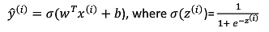
### 2.3 逻辑回归的代价函数
* 逻辑回归中的损失函数，又叫误差函数，用来衡量算法的运行情况。
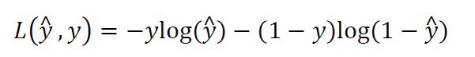
* 损失函数是在单个训练样本中定义的，它衡量的是算法在单个训练样本中表现，为了衡量算法在全部训练集样本上的表现，需要定义一个算法的代价函数，该算法的代价函数是𝑚个样本的损失函数求和然后除以𝑚:
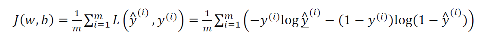
* 损失函数只适用于单个训练样本；代价函数适用于整个训练样本集。
### 2.4~2.6 梯度下降法和导数
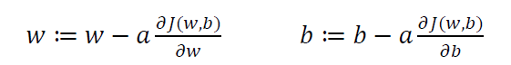
### 2.7~2.8 计算图、使用计算图求导数
* chain rule 链式法则
### 2.9~2.10 逻辑回归、m个样本的梯度下降
* 各种求导方法及公式回顾，比如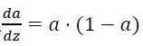的计算方法。
* 关于单个样本的梯度下降算法：

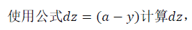
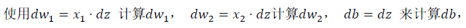
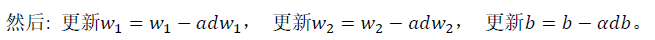
* 关于m个样本的梯度下降算法：代码流程
```
J=0;dw1=0;dw2=0;db=0;
for i = 1 to m
    z(i) = wx(i)+b;
    a(i) = sigmoid(z(i));
    J += -[y(i)log(a(i))+(1-y(i)）log(1-a(i));
    dz(i) = a(i)-y(i);
    dw1 += x1(i)dz(i);
    dw2 += x2(i)dz(i);
    db += dz(i);
J/= m;
dw1/= m;
dw2/= m;
db/= m;
w=w-alpha*dw
b=b-alpha*db
```
### 2.11~2.14 向量化及逻辑回归梯度输出
* 向量化是去除代码中for循环的艺术。向量化可以一次同时训练多个样本，即如何在CPU硬件基础上加快训练速度。
* 不使用for循环，利用m个训练样本计算Z和A(前向传播向量化计算)：
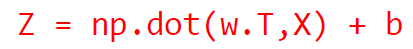
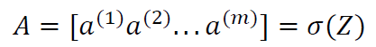
* 向量化的逻辑回归梯度
* 下降算法：
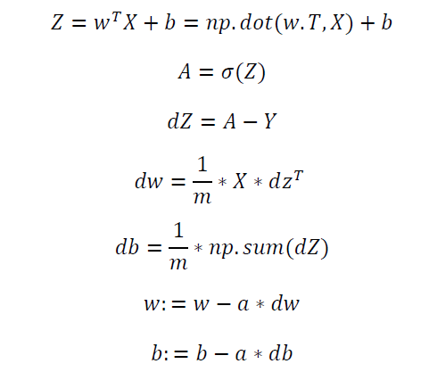
### 2.15~2.17 python/numpy/广播机制说明
* numpy广播机制：如果两个数组的后缘维度的轴长度相符或其中一方的轴长度为1，则认为它们是广播兼容的。广播会在确实维度和轴长度为1的维度上进行。
* 可使用命令assert(a.shape == (5,1))来判断a向量的维度。
* a。reshape命令可修改向量a的维度。
### 2.18 logistic损失函数的解释
* 预测的结果与训练样本的条件概率公式为：
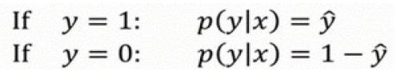
* 将这两个公式合并为一个公式：

* 由于log函数是严格递增函数，最大化log(P(y|x))等价于最大化P(y|x)并且计算P(y|x)的log对数，将上式带入并化简即得：

* 对于损失函数有负号的原因是训练学习算法是需要算法输出值的概率是最大的，然而在逻辑回归中需要最小化损失函数。因此加负号使得最小化损失函数与最大化条件概率的对数log(P(y|x))关联起来了。
* 以上为单个训练样本的损失函数表达式，对于m个训练样本的整个训练集，假设所有样本服从同一分布且相互独立，所有样本的联合概率就是每个样本概率的乘积。确定最大似然估计量的问题，可以归结为求最大值的问题了。一般的求最大似然估计，都是转化为对数形式的似然函数来进行求解：
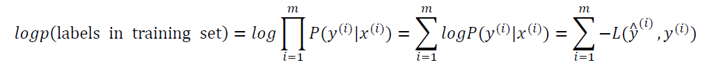
* 由于训练模型时，目标是让成本函数最小化，所以去掉这里的负号；最后对成本函数进行适当缩放，得
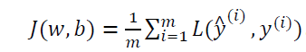
### Programming Assignments(作业思路的整体把握及要点总结)
#### Logistic Regression with a Neural Network mindset
What you need to remember:
Common steps for pre-processing a new dataset are:
* Figure out the dimensions and shapes of the problem (m_train, m_test, num_px, ...)
* Reshape the datasets such that each example is now a vector of size (num_px * num_px * 3, 1)
* "Standardize" the data

#### - Building the parts of our algorithm
The main steps for building a Neural Network are:

Define the model structure (such as number of input features)
Initialize the model's parameters)
Loop:
* Calculate current loss (forward propagation)
* Calculate current gradient (backward propagation)
* Update parameters (gradient descent)
- You often build 1-3 separately and integrate them into one function we call model().
  
What to remember: You've implemented several functions that:

1. Initialize (w,b)
2. Optimize the loss iteratively to learn parameters (w,b):
   * computing the cost and its gradient
    * updating the parameters using gradient descent
3. Use the learned (w,b) to predict the labels for a given set of examples

In deep learning, we usually recommend that you:
* Choose the learning rate that better minimizes the cost function.
* If your model overfits(过拟合), use other techniques to reduce overfitting.
#### - What to remember from this assignment:
1. Preprocessing the dataset is important.
2. You implemented each function separately: initialize(), propagate(), optimize(). Then you built a model().
3. Tuning the learning rate (which is an example of a "hyperparameter") can make a big difference to the algorithm.

## 3 Shallow Neural Networks（浅层神经网络）
### 3.1~3.2 神经网络概述及表示
* 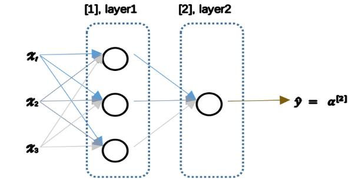
* 使用符号[m]表示第𝑚层网络中节点相关的数，这些节点的集合被称为第𝑚层网络。
* 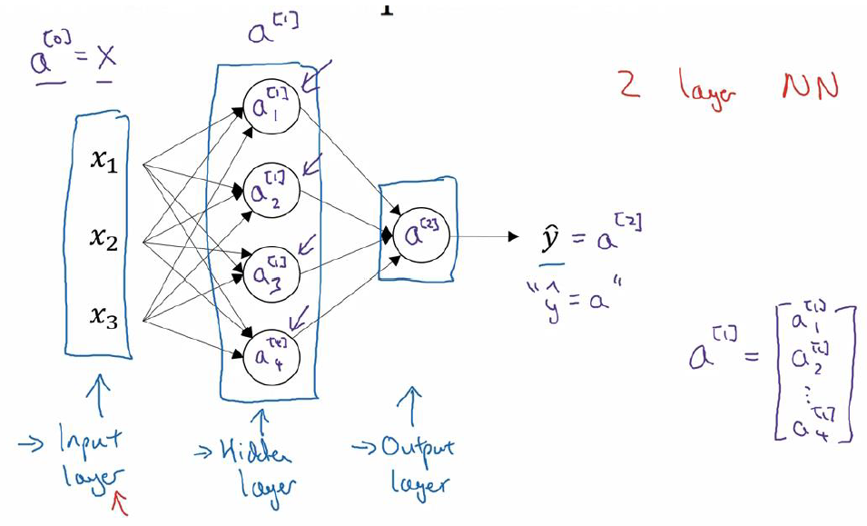
输入层：x1,x2,x3

隐藏层 hidden layer：有两个参数W,b

输出层 output layer：负责产生预测值 y_hat

因为不将输入层看作一个标准的层，故为一个两层的神经网络。

### 3.3 计算一个神经网络的输出
x表示输入特征，a表示每个神经元（每个圆点）的输出，W表示特征的权重，上标表示神经网络的层数（隐藏层为1），下标宝石该层的第几个神经元，这是神经网络的符号惯例。
* 神经元的计算与逻辑回归一样分为两步：

第一步，计算z[1]1,z1[1]=w[1]T1x+b[1]1。

第二步，通过激活函数计算a[1]1,a[1]1=σ(z[1]1)。

隐藏层的第二个以及后面两个神经元的计算过程一样，只是注意符号表示不同
### 3.4~3.5 多样本向量化及实现解释
* 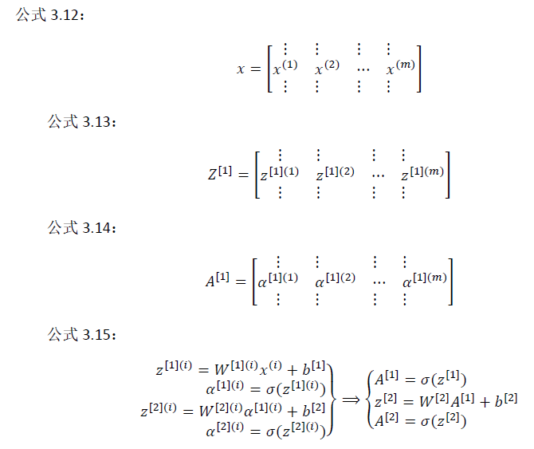
* 对于X，水平方向上对应于各个训练样本；竖直方向上对应于不同的输入特征。
  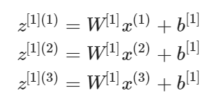
  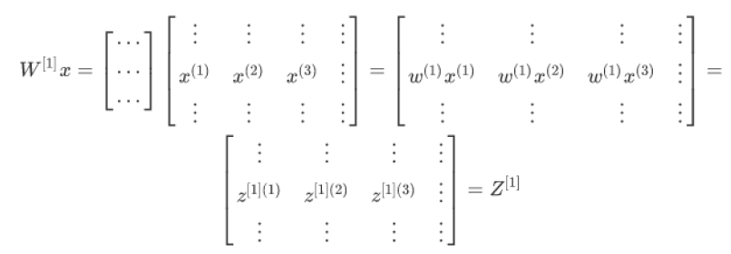
矩阵乘以列向量得到列向量。当有不同的训练样本时，将它们堆到矩阵𝑋的各列中，那么它们的输出也就会相应的堆叠到矩阵 Z[1] 的各列中。

### 3.6~3.8 激活函数及其导数
* 当时用一个神经网络时，需要决定使用那种激活函数用在隐藏层上，哪些用在输出节点上。在不同的神经网络层中，激活函数可以不同。
* sigmoid 函数：
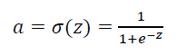
* tanh 函数或者双曲正切函数是总体上都优于 sigmoid 函数的激活函数：
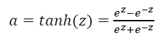

tanh 函数是 sigmoid 的向下平移和伸缩后的结果。对它进行了变形后，穿过了 (0,0)点，并且值域介于+1 和-1 之间。

结果表明，如果在隐藏层上使用函数𝑡𝑎𝑛ℎ(𝑧^{1}),其效果总是优于sigmoid() 函数。因为函数值域在-1 和+1 的激活函数，其均值是更接近零均值的。在训练一个算法模型时，如果使用 tanh 函数代替 sigmoid 函数中心化数据，使得数据的平均值更接近 0 而不是 0.5。

在二分类的问题中，对于输出层，因为𝑦的值是 0 或 1，所以想让𝑦_hat的数值介于 0 和 1 之间，而不是在-1 和+1 之间，所以需要使用 sigmoid 激活函数。

sigmoid 函数和 tanh 函数两者共同的缺点是，在𝑧特别大或者特别小的情况下，导数的 梯度或者函数的斜率会变得特别小，最后就会接近于 0，导致降低梯度下降的速度。

另一个很流行的函数是：修正线性单元的函数（ReLu）:
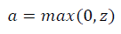

只要𝑧是正值的情况下，导数恒等于 1，当𝑧是负值的时候，导数恒等于0。

一些选择激活函数的经验法则：

如果输出是 0、1 值（二分类问题），则输出层选择 sigmoid 函数，然后其它的所有单元都选择Relu函数。

另一个版本的 Relu 被称为 Leaky Relu：
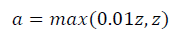

当𝑧是负值时，这个函数的值不是等于 0，而是轻微的倾斜。这个函数通常比 Relu 激活函数效果要好，尽管在实际中 Leaky ReLu 使用的并不多。

两者的优点是：

第一，在𝑧的区间变动很大的情况下，激活函数的导数或者激活函数的斜率都会远大于 0，在程序实现就是一个 if-else 语句，而sigmoid 函数需要进行浮点四则运算，在实践中， 使用 ReLu 激活函数神经网络通常会比使用 sigmoid 或者 tanh 激活函数学习的更快。

第二，sigmoid 和 tanh 函数的导数在正负饱和区的梯度都会接近于 0，这会造成梯度弥散，而 Relu 和 Leaky ReLu 函数大于 0 部分都为常数，不会产生梯度弥散现象。(同时应该注 意到的是，Relu 进入负半区的时候，梯度为 0，神经元此时不会训练，产生所谓的稀疏性， 而 Leaky ReLu 不会有这问题)

尽管𝑧在 ReLu 的梯度一半都是0，但是，有足够的隐藏层保证z值大于 0，所以对大多数的 训练数据来说学习过程仍然可以很快。
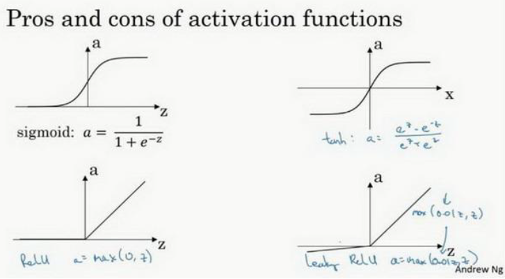

概括一下：

sigmoid 激活函数：除了输出层是一个二分类问题基本不会用它；tanh激活函数几乎适合所有场合；ReLu 激活函数：最常用的默认函数。如果不确定用哪个激活函数，就使用 ReLu 或者 Leaky ReLu。
* 为什么需要使用非线性激活函数？
* 两个线性函数的组合本身还是线性函数，如果只用线性激活函数或者叫恒等激励函数，那么神经网络只是把输入线性组合再输出。那么无论神经网络有多少层一直在做的只是计算线性函数，则与直接去掉全部隐藏层的效果是一样的。
* 故不能再隐藏层使用线性激活函数，唯一可以用线性激活函数的通常在输出层。
* 四种常见的激活函数的导数：
* sigmiod()函数 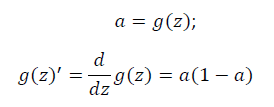
* tanh()函数 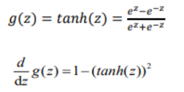
* ReLU函数 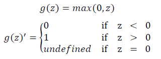
* leaky ReLU函数 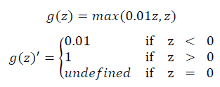
### 3.9~3.10 神经网络的梯度下降和理解反向传播
* 神经网络的正向传播：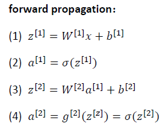
* 神经网络的反向传播：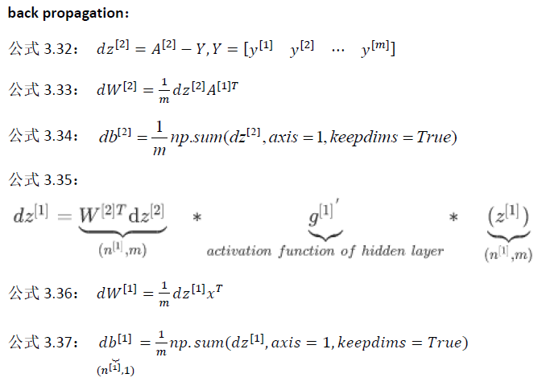
* 𝑌是1 × 𝑚的矩阵； 这里 np.sum 是 python 的 numpy 命令，axis=1 表示水平相加求和，keepdims 是防止 python 输出那些古怪的秩数(𝑛, )，加上这个确保阵矩阵𝑑𝑏 [2]这个向量输出的维度为(𝑛, 1)这样标准的形式。
* A[1]T和XT 这里多了转置的原因是dw中的W是一个列向量，而W[2]是一个行向量。
### 3.11 随机初始化权重
* 在训练神经网络的时候，随机初始化参数很重要，而不是初始化为全0；若全部初始化为0，则所有的神经单元输入相同，输出权值也相同，使得所有隐藏单元对称，一次迭代后同样的表达式结果仍然是相同的，即隐含单元仍是对称的。通过推导，两次、三次、无论多少次迭代，不管训练网络多长时间，隐含单元仍然计算的是同样的函数。
* 通常随机初始化参数，并且再乘上一个比较小的数，比如0.01。乘一个较小的数的目的是加快学习速率(使之处在梯度较大的位置)，当然0.01不是固定的，也可以取其他较小的值。
### Programming Assignments(作业思路的整体把握及要点总结)
* pic 习题9 每个Vector demension按照公式W[l].shape=(n[l], n[l-1]), b[l].shape=(n[l], 1)，A.shape=Z.shape=(n[l], m)。
* 
* Reminder: The general methodology to build a Neural Network is to:

1. Define the neural network structure ( # of input units,  # of hidden units, etc). 
2. Initialize the model's parameters
3. Loop:
    - Implement forward propagation
    - Compute loss
    - Implement backward propagation to get the gradients
    - Update parameters (gradient descent)
4. test you dataset

## 4 深层神经网络
### 4.1 深层神经网络
* 深层网络与浅层网络的区别在于隐藏层的数量，易知逻辑回归模型类似浅层神经网络。一个四层神经网络的符号表示为：
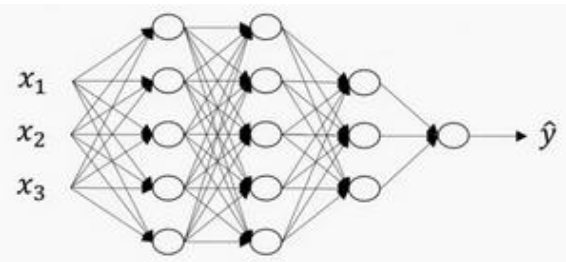
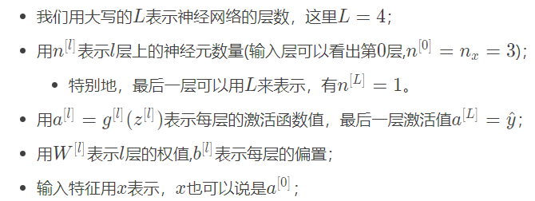
### 4.2 深层网络中的前向传播
* 对于一个样本：
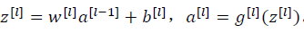
* 对于m个样本，向量化后为：
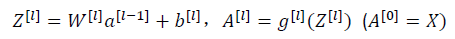
### 4.3 核对矩阵的维数
* 每个矩阵的维度在代码中非常容易出错，总结一下每个向量的维度：
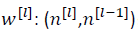
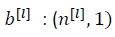
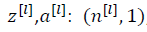
* 向量化后：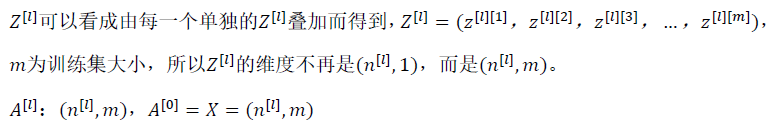
### 4.4~4.6 前向传播和反向传播
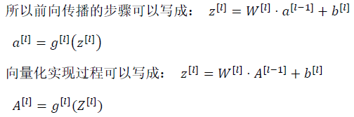
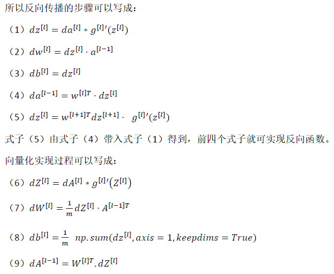
### 4.7 参数VS超参数
* 超参数就是输入到学习算法的参数，比如learning rate、#iterations、#hidden leyer L、#hidden units n[1],n[2]、激活函数种类，这些参数会控制我们得到的参数W,bW,bW,b，因此它们叫超参数。
应用深度学习是非常依据经验的（empirical），所以需要不停的尝试来选取合适值。要注意的是，在开发的过程中，可能学习率(或其他超参数)的最优数值是会由于电脑的CPU或GPU或者数据变化的。
### 4.8 深度学习和人类大脑的关联
* It's like the brain, but this type of matepher is out of date.
* 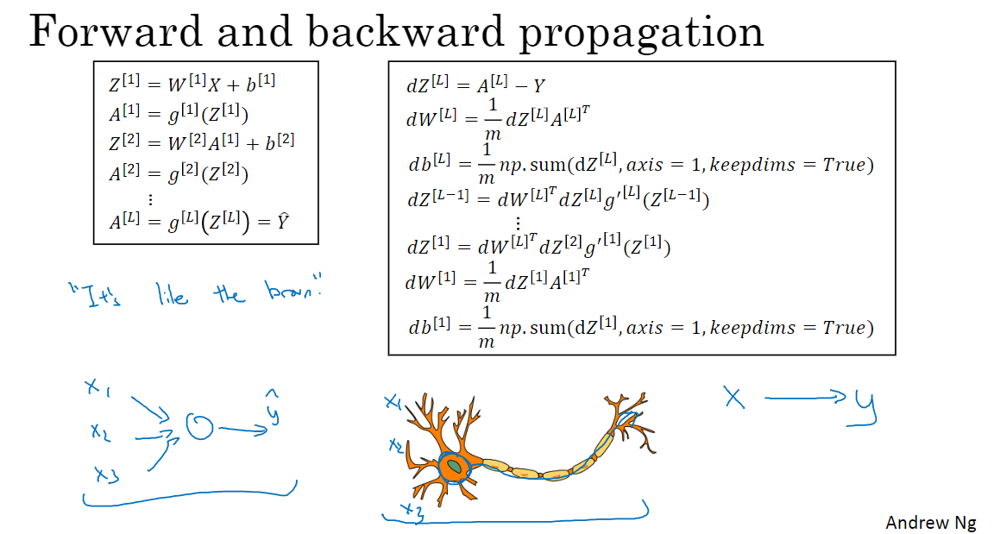

### Programming Assignments(作业思路的整体把握及要点总结)
* In deep learning, the "[LINEAR->ACTIVATION]" computation is counted as a single layer in the neural network, not two layers.
* Use non-linear units like ReLU to improve your model
Build a deeper neural network (with more than 1 hidden layer)

* 3.3 - General methodology
 follow the Deep Learning methodology to build the model:

1. Initialize parameters / Define hyperparameters
2. Loop for num_iterations:
    a. Forward propagation
    b. Compute cost function
    c. Backward propagation
    d. Update parameters (using parameters, and grads from backprop) 
3. Use trained parameters to predict labels
   
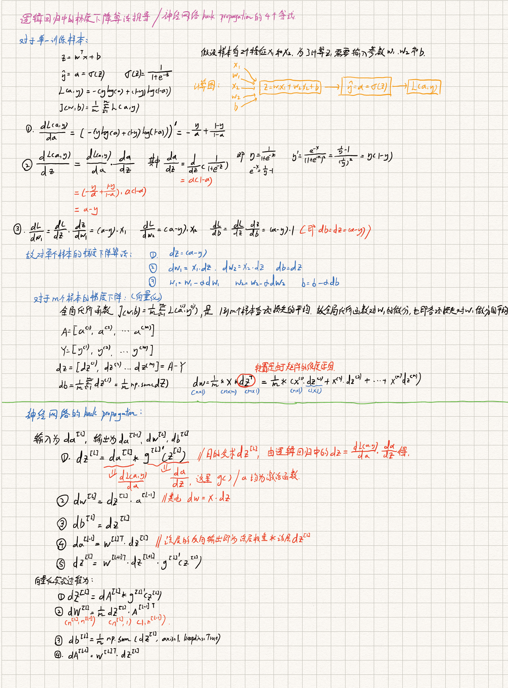
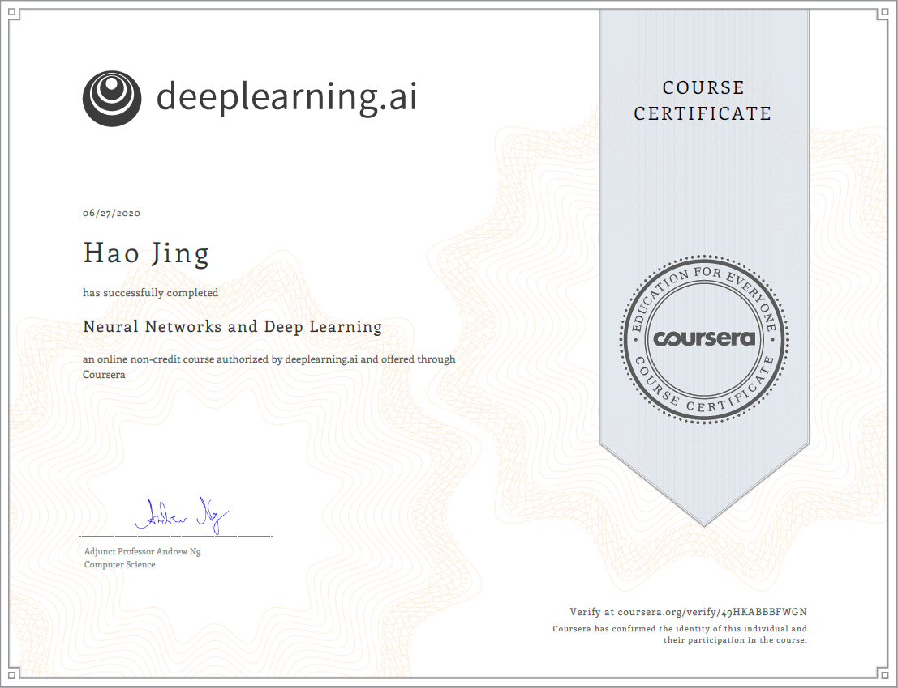