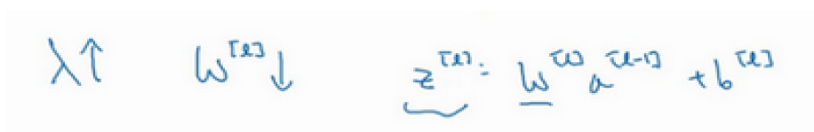
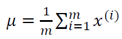
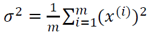
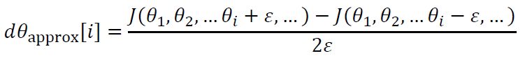
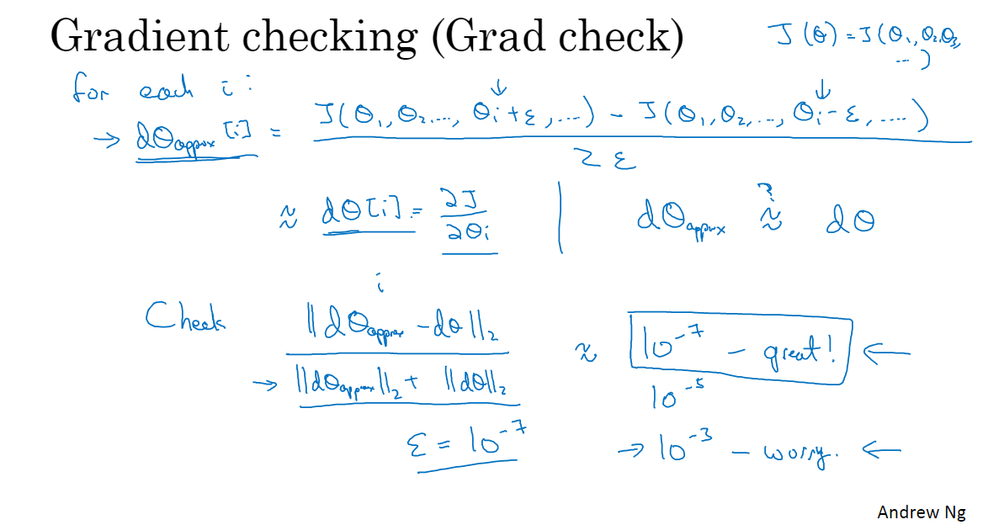
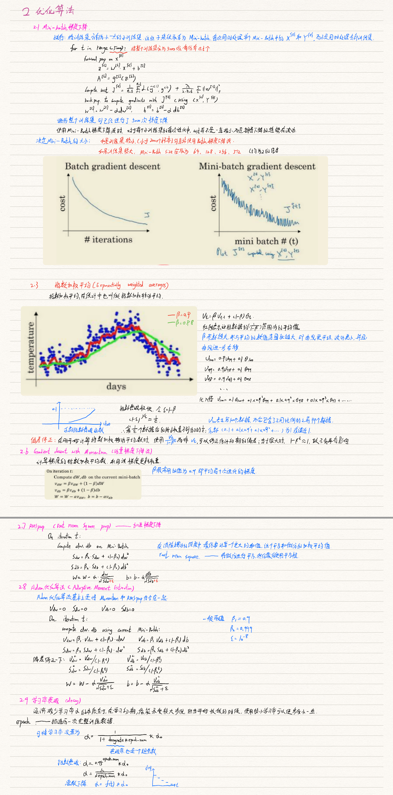
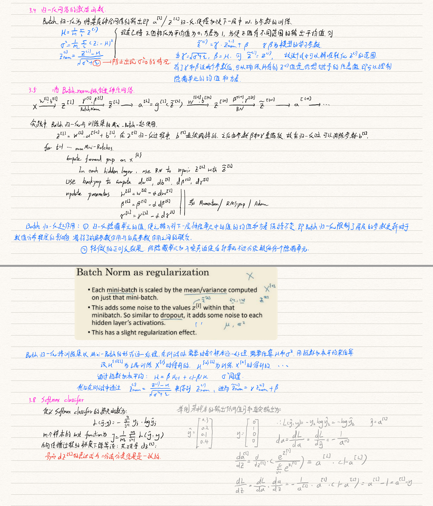
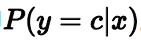
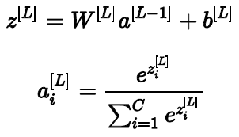
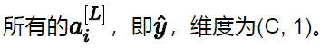

# Improving Deep Neural Networks：Hyperparameter tuning、Regularization and Optimization
## 1 Practical aspects of Deep Learning
### 1.1 训练集、验证集、测试集
* 在大数据时代，随着拥有的数据量指数级上升，目前训练集在神经网络中占比更大，验证集和测试集所占比例更小；验证集的目的是验证不同的算法哪种更有效，测试集的目的是判断该classifier的性能。对于数据超过一百万的应用，训练集占99.5%，验证集合测试集各占0.25%。
* 要保证验证集合测试集的数据来自同一分布。
* 没有测试集也OK，因为它的目的是对最终选定的神经网络系统做出无偏估计，吴国不需要无偏估计，也可以不设置测试集。
* 搭建训练验证集和测试集能够加速神经网络的集成，也可以更有效地衡量算法的偏差和方差，从而选择更合适的方法来优化算法。
### 1.2~1.3 偏差/方差（bias/variance）机器学习基础
* 高偏差即欠拟合，高方差即过拟合。
* 通过查看训练集误差和验证集误差，可以判断数据拟合情况。对于训练集可以查看偏差问题，对于验证集可以查看方差问题。
* 通过适度正则化，构建一个规模更大的网络可以减少偏差（不影响方差），采用更多的数据可以减少方差（不影响偏差）。
### 1.4~1.8 正则化/L2正则化/dropout/其他正则化方法
* 引用西瓜书中的解释：“当学习器把训练样本学得“太好”了的时候，很可能已经把训练样本本身的一些特点当做了所有潜在样本都会具有的一般性质，这样就会导致泛化性能下降，这种现象就是机器学习中的过拟合”。“正则化削减了（容易过拟合的那部分）假设空间，从而降低过拟合风险”。
* 解决高方差即过拟合的方法有两种：1、准备更多数据集2、正则化
* L2范数正则化被称为权重衰减，内容有点散，手写笔记整理下： 

* 为什么正则化有利于预防过拟合？
直观上理解，正则项可以避免数据权值矩阵过大，如果正则化lamda设置足够大，权值矩阵W则接近于0，即把许多隐藏单元的权重设为0，消除了许多隐藏单元的影响，简化了初始的神经网络为更小的网络，但深度未变，故可使过拟合状态接近于高偏差状态；实际上，每个隐藏单元依然存在，但是每一个单元的影响变得更小了。
* 对于正则化参数lambda：
* z相对较小的情况下，激活函数的范围接近线性函数，则整个网络会计算离线性函数近的值，这个线性函数非常简单，并不是一个复杂的高度非线性函数，不会发生过拟合。
### 1.9 归一化输入
* 归一化输入可以加速训练过程，有两个步骤：
 a 零均值；
  x = x - μ，即完成移动训练集到均值为0，。
* b 归一化方差

  x /= σ^2
* 注：如果用归一化来调整训练数据，则应用相同的μ和σ来归一化测试集。归一化数据集使得代价函数看起来更对称，运行梯度下降法时能够更快的找到最小值。
### 1.10~1.11 梯度消失/梯度爆炸/ 权重初始化 /
* 当权重比单位矩阵大一点，则深度神经网络的激活函数将爆炸式增长；如果权重W比1略小一点，则激活函数将以指数级递减；这个不仅适用于激活函数，也适用于与层数L相关的导数或梯度函数。
* 神经网络的权重初始化可以略微减弱梯度消失和梯度爆炸问题。
### 1.12~1.14 梯度的数值逼近/梯度检验/ 
* 梯度检验可以帮助我们发现back propagation实施过程中的bug。
* grad check：

* 应用梯度检验的注意事项：
  - 不要在训练集中使用梯度检验，梯度检验只用于调试；
  - 如果算法的梯度检验失败，要检查所有项，如果某层的dw各项非常接近，则db中可能存在bug；vice versa；
  - 实施梯度检验时，如果使用正则化，应注意代价函数加上正则项；
  - 梯度检验不能与dropout同时使用；

Conclusions：这一章主要包括训练集、验证集和测试集的比例配置；分析偏差和方差；正则化处理过拟合问题的三种方法及原理；如何加快神经网络训练速度；梯度检验；重点理解记忆正则化的原理及方法实现、归一化输入的目的及实现、反向梯度下降传播的梯度检验实现。

What you should remember:

The weights  W[l]W[l]  should be initialized randomly to break symmetry.
It is however okay to initialize the biases  b[l]b[l]  to zeros. Symmetry is still broken so long as  W[l]W[l]  is initialized randomly.
Initializing weights to very large random values does not work well.
Hopefully intializing with small random values does better. 
Different initializations lead to different results
Random initialization is used to break symmetry and make sure different hidden units can learn different things
Don't intialize to values that are too large
He initialization works well for networks with ReLU activations.

## 2 优化算法
### 2.1 Mini-Batch梯度下降
* 巨大的数据集使得训练神经网络时速度特别慢，Mini-Batch思想是在处理完整个数据集之前，先让梯度下降法处理一个部分，则算法会越来越快。

### 2.10 局部最优问题
在神经网络训练过程中，由于存在较多参数，成本函数J不太可能困在极差的局部最优中；更加可能碰到的是saddle point，即鞍点。鞍点附近的区域非常平缓，会导致算法速率很慢，而算法速率很慢可由以上提到的Adam、Monmentom、RMSprop来加速训练速度。

What you should remember:
The difference between gradient descent, mini-batch gradient descent and stochastic gradient descent is the number of examples you use to perform one update step.
You have to tune a learning rate hyperparameter  α .
With a well-turned mini-batch size, usually it outperforms either gradient descent or stochastic gradient descent (particularly when the training set is large).
How do you choose  β ?

The larger the momentum  ββ  is, the smoother the update because the more we take the past gradients into account. But if  β  is too big, it could also smooth out the updates too much.
Common values for  β  range from 0.8 to 0.999. If you don't feel inclined to tune this,  β=0.9  is often a reasonable default.
Tuning the optimal  β  for your model might need trying several values to see what works best in term of reducing the value of the cost function  J .

What you should remember:

Momentum takes past gradients into account to smooth out the steps of gradient descent. It can be applied with batch gradient descent, mini-batch gradient descent or stochastic gradient descent.
You have to tune a momentum hyperparameter  β  and a learning rate  α .

## 3 超参数调试、Batch正则化和程序框架
### 3.1 调试处理 / 选择合适范围的超参数 / 超参数调试实践
* 在选择超参数数值时，采用随机化选择点的方式，首先进行大致的选择，当发现某些区域的取值效果更好，那么之后在这个区域进行细化取值，更加密集地取值。
* 随机取值，并不是在有效值范围内的随机均匀取值，而是选择合适的标尺之后的均匀取值。比如对于整数取值范围可以采用线性标尺；对于小数例如beta的选择范围从0.9~0.999，则应该采用对数坐标尺进行随机选择。
* 超参数调试实践的两种方法：
   根据所拥有的计算资源分类，如果计算资源比如GPU和CPU不足的前提下（Panda)，每次人为照看一个训练模型并不断的在训练过程中修改参数；如果计算资源很充足(Caviar)，可以在设置参数不同的情况下同时进行模型训练，之后观测模型表现进而选取对应的参数值。
### 3.4 归一化网络的激活函数

### 3.8 Softmax Regression
* 对于多分类问题，用C表示种类个数，神经网络中输出层就有C个神经元，即n[L]=C。其中，每个神经元的输出依次对应属于该类的概率，即

* 为了处理多分类问题，我们一般使用Softmax回归模型。Softmax回归模型输出层的激活
函数如下所示：

* 定义Softmax的代价函数为

### Conclusion：
主要了解系统组织超参数搜索过程、batch normalization用来加速神经网络的训练以及神经网络编程框架的选择。