# 卷积神经网络(Convolutional Neural Network)
## 1 卷积神经网络
### 1.1 计算机视觉
计算机视觉（Computer Vision）是深度学习应用的主要方向之一。一般的CV问题包括以下三类：
Image Classification
Object detection
Neural Style Transfer
使用传统神经网络处理计算机视觉的一个主要问题是输入层维度很大。一是导致神经网络结构复杂，数据量相对不够，容易出现过拟合；二是所需内存、计算量较大。解决这一问题的方法就是使用卷积神经网络（CNN）。
### 1.2~1.3 边缘检测实例
最常检测的图片边缘有两类：一是垂直边缘（vertical edges），二是水平边缘（horizontal edges）。图片的边缘检测可以通过与相应滤波器进行卷积来实现。
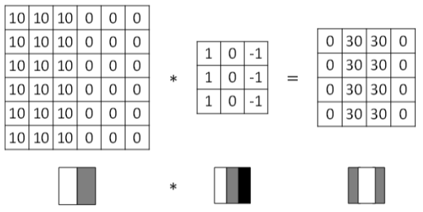
除了提到的这种简单的Vertical、Horizontal滤波器之外，还有其它常用的filters，例如Sobel filter和Scharr filter。这两种滤波器的特点是增加图片中心区域的权重。
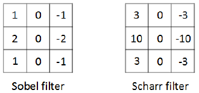

上图展示的是垂直边缘检测算子，水平边缘检测算子只需将上图顺时针翻转90度即可。
在深度学习中，如果我们想检测图片的各种边缘特征，而不仅限于垂直边缘和水平边缘，那么filter的数值一般需要通过模型训练得到，类似于标准神经网络中的权重W一样由梯度下降算法反复迭代求得。CNN的主要目的就是计算出这些filter的数值。确定得到了这些filter后，CNN浅层网络也就实现了对图片所有边缘特征的检测。
### 1.4~1.5 Padding/Strided Convoluitons
按照我们上面讲的图片卷积，如果原始图片尺寸为n x n，filter尺寸为f x f，则卷积后的图片尺寸为(n-f+1) x (n-f+1)，注意f一般为奇数。这样会带来两个问题：
1.卷积运算后，输出图片尺寸缩小
2.原始图片边缘信息对输出贡献得少，输出图片丢失边缘信息
为了解决图片缩小的问题，可以使用padding方法，即把原始图片尺寸进行扩展，扩展区域补零，用p来表示每个方向扩展的宽度。
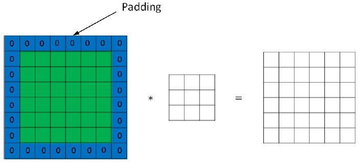
经过padding之后，原始图片尺寸为(n+2p) x (n+2p)，filter尺寸为f x f，则卷积后的图
片尺寸为(n+2p-f+1) x (n+2p-f+1)。若要保证卷积前后图片尺寸不变，则p应满足：

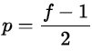
没有padding操作，即p=0，我们称之为“Valid convolutions”；有padding操作，p=(f-1)/2，我们称之为“Same convolutions”。
Stride表示filter在原图片中水平方向和垂直方向每次的步进长度。之前我们默认stride=1。若stride=2，则表示filter每次步进长度为2，即隔一点移动一次。 
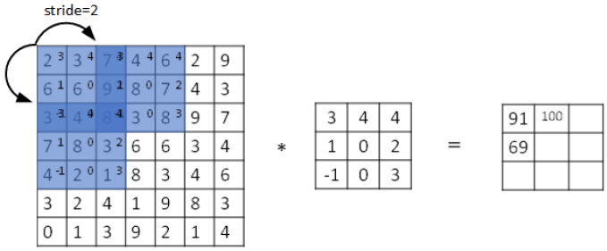
我们用s表示stride长度，p表示padding长度，如果原始图片尺寸为n x n，filter尺寸为fx f，则卷积后的图片尺寸为：
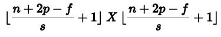
### 1.6 三维卷积
对于3通道的RGB图片，其对应的滤波器算子同样也是3通道的。例如一个图片是6x6x3，分别表示图片的高度（height）、宽度（weight）和通道（#channel）。3通道图片的卷积运算与单通道图片的卷积运算基本一致。过程是将每个单通道（R，G，B）与对应的filter进行卷积运算求和，然后再将3通道的和相加，得到输出图片的一个像素值。 
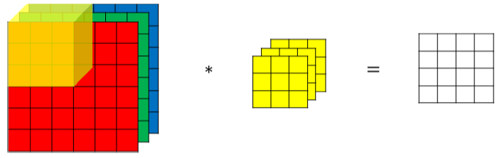
为了对同一图片进行多个卷积运算，实现更多不同类型的边缘检测，可以增加更多的滤波器组。例如设置第一个滤波器组实现垂直边缘检测，第二个滤波器组实现水平边缘检测。这样，不同滤波器组卷积得到不同的输出，个数由滤波器组决定。
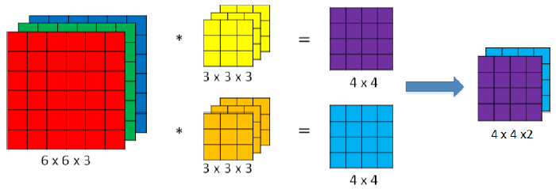
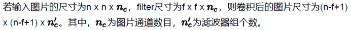
### 1.7~1.8 单层卷积网络/简单卷积网络实例
卷积神经网络的单层结构如下所示：
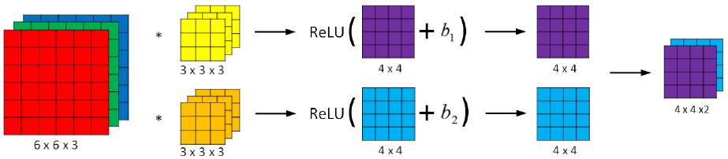
相比之前的卷积过程，CNN的单层结构多了激活函数ReLU和偏移量b。整个过程与标准的神经网络单层结构非常类似：
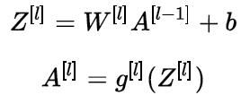

总结一下CNN单层结构的所有标记符号，设层数为l：
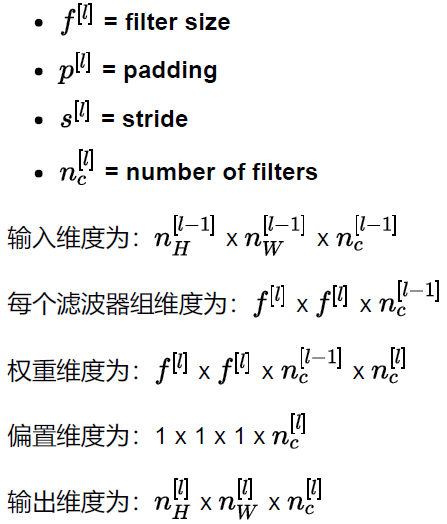
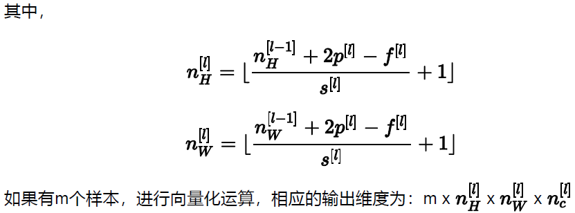

下面介绍一个简单的CNN网络模型：
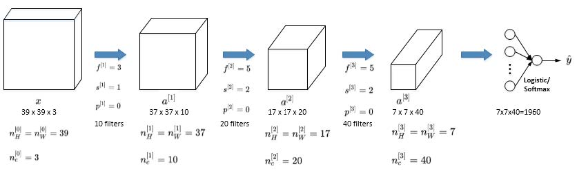

CNN有三种类型的layer：
1.Convolution层（CONV）
2.Pooling层（POOL）
3.Fully connected层（FC）
CONV最为常见也最重要，下面介绍POOL和FC。

### 1.9 Pooling Layers
Pooling layers是CNN中用来缩减模型大小，提高运算速度，同样能减小noise影响，提高所提取特征的鲁棒性。
Pooling layers的做法比convolution layers简单许多，没有卷积运算，仅仅是在滤波器算子滑动区域内取最大值，即max pooling，这是最常用的做法。注意，超参数p很少在pooling layers中使用(p=0)。池化可分为 Max Pooling 和 Average Pooling：
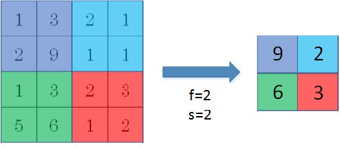

Max pooling的好处是只保留区域内的最大值（特征），忽略其它值，降低noise影响，提高模型健壮性。而且，max pooling需要的超参数仅为滤波器尺寸f和滤波器步长s，没有其他参数需要通过模型训练得到，计算量很小。如果是多个通道，那么每个通道单独进行max pooling操作。
除了max pooling之外，还有一种做法：average pooling。顾名思义，average pooling就是在滤波器算子滑动区域计算平均值。实际应用中，max pooling比average pooling更为常用。
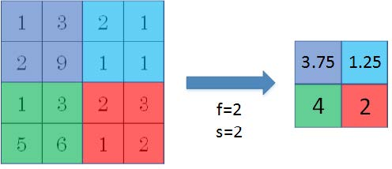
### 1.10~1.11 CNN example
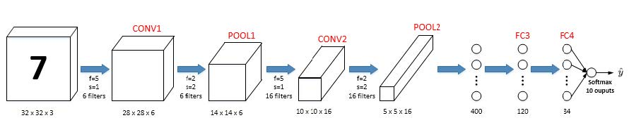
图中，CON层后面紧接一个POOL层，CONV1和POOL1构成第一层，CONV2和POOL2构成第二层。特别注意的是FC3和FC4为全连接层FC，它跟标准的神经网络结构一致。最后的输出层（softmax）由10个神经元构成。
相比标准神经网络，CNN的优势之一就是超参数数目要少得多。参数数目少的原因有两个：
参数共享：一个特征检测器（例如垂直边缘检测）对图片某块区域有用，同时也可能适用于图片的其它区域。
稀疏连接：因为滤波器算子尺寸限制，每一层的每个输出只与输入的部分区域有关。
除此之外，由于CNN参数数目较小，所需的训练样本就相对较少，从而一定程度上不容易发生过拟合现象。而且，CNN比较擅长捕捉区域位置偏移。也就是说CNN进行物体检测时，不太受物体所处图片位置的影响，增加检测的准确性和系统的健壮性。

构建一个图片分类器的步骤：选定一个卷积神经网络；输入图片；增加卷积层、池化层和全连接层；输出softmax，即y_hat；定义代价函数；训练神经网络（梯度下降发、Monmentum、RMSprop、ADam）；使得代价参数最小化，得到参数W及偏差b的合适值，即完成了一个图片分类器的神经网络搭建。

Window, kernel, filter
The words "window", "kernel", and "filter" are used to refer to the same thing. This is why the parameter ksize refers to "kernel size", and we use (f,f) to refer to the filter size. Both "kernel" and "filter" refer to the "window."

## 2 深度卷积模型：案例研究
### 2.1 Why look at case studies？
* 通过对具体CNN模型及案例的研究，来帮助我们理解知识并训练实际的模型。
典型的CNN模型包括：
LeNet5
AlexNet
VGG
除了这些性能良好的CNN模型之外，我们还会介绍Residual Network（ResNet），其特点是可以构建很深很深的神经网络（目前最深的神经网络有152层）；另外，还会介绍Inception Neural Network。
### 2.2 Classic Networks
LeNet5模型是Yann LeCun教授于1998年提出来的，它是第一个成功应用于数字识别问题的卷积神经网络（该模型是针对灰度图像训练的，即输入图像数据的通道数为1）。在MNIST数据中，它的准确率达到大约99.2%。典型的LeNet5结构包含CONV layer，POOL layer和FC layer，顺序一般是CONV layer>POOLlayer>CONV layer>POOL layer>FC layer>FC layer>OUTPUT layer，下图所示的是一个数字识别的LeNet5的模型结构：
pic 1
该LeNet模型总共包含了大约6万个参数。1998年人们不使用Padding，故没进行一次卷积，图像的高度和快读都会缩小。值得一提的是，当时Yann LeCun提出的LeNet5模型池化层使用的是average pool，而且各层激活函数一般是Sigmoid和tanh。现在，我们可以根据需要做出改进，使用max pool和激活函数ReLU。
这种神经网络的模式经常用到：一个或多个卷积层后面跟一个池化层，然后又是若干个卷积层再接一个池化层，然后是全连接层，最后是输出。

AlexNet模型是由Alex Krizhevsky、Ilya Sutskever和Geoffrey Hinton共同提出的，其结构如下所示：pic 2
AlexNet模型与LeNet5模型类似，只是要复杂一些，总共包含了大约6千万个参数。同样可以根据实际情况使用激活函数ReLU。原作者还提到了一种优化技巧，叫做Local Response Normalization(LRN)，而在实际应用中，LRN的效果并不突出。

VGG16
一般情况下，该模型其CONV layer和POOL layer设置如下：
CONV = 3x3 filters, s = 1, same
MAXPOOL= 2x2, s = 2
VGG16网络没有很多超参数，这是一种只需要专注于构件卷积层的简单网络。VGG16模型结构如下所示：pic 3

VGG16中的16，表示这个网络中包含16个卷积层和全连接层，总共包含1.38亿个参数。这种网络结构很规整，都是几个卷积层后面跟着可以压缩图像大小的池化层，池化层缩小图像的高度和宽度；同时卷积层的过滤器数量变化存在一定规律，由64变为128变为256变为512，即在每一组卷积层进行过滤器翻倍。
### 2.3~2.4 残差网络(ResNets/Residual Networks)
由于存在梯度消失和梯度爆炸问题，深度很深的神经网络是很难训练的。解决方法之一是人为地让神经网络某些层跳过下一层神经元的连接，隔层相连，弱化每层之间的强联系，即跳跃连接(skip connection)。用它可以构建能够训练深度网络的ResNets，这种神经网络被称为Residual Networks(ResNets)。
Residual Networks由许多隔层相连的Residual block组成，单个Residual block的结构如下图所示：
pic 4 
上图的红色部分直接建立a[l]与a[l+2]隔层之间的联系，相应的表达式为：
pic 5678
a[l]隔层与a[l+1]层的线性输出相连，与Z[l+2]共同通过激活函数输出a[l+2]。
该模型由Kaiming He, Xiangyu Zhang, Shaoqing Ren和Jian Sun共同提出。由多个Residual block组成的神经网络就是Residual Network，该网络结构如下图： pic 9
Residual Network能够训练更深层的神经网络，有效避免发生梯度消失和梯度爆炸问题。
为什么ResNets能够训练更深层的神经网络？
pic 10
如上图所示，输入X经过Big NN输出为a[l]，a[l]经过一个Residual block输出a[l+2]，一种
pic11
如果使用L2正则化或权重衰减，它会压缩W[l+2]的值，假设b[l+2]=0，则有 pic 12 
可以看出，即使发生了梯度消失，即W[l+2]=0，b[l+2]=0，也能直接建立a[l+2]与a[l]的线性关系，这就是恒等函数。
a[l]直接连到a[l+2]，从效果来说，相当于直接忽略了之后的这两层神经层。这样，看似很深的神经网络，其实由于许多Residual blocks的存在，弱化削减了某些神经层之间的联系，实现隔层线性传递，而不是一味追求非线性关系，模型本身也就能“容忍”更深层的神经网络了。而且从性能上来说，这两层额外的Residual blocks也不会降低Big NN的性能。当然，如果Residual blocks确实能训练得到非线性关系，那么也会忽略short cut，跟普通深度网络起到同样的效果。
有一点需要注意的是，如果Residual blocks中a[l]和a[l+2]的维度不同，通常可以引入矩阵Ws，与a[l]相乘，使得Ws*a[l]的维度与a[l+2]一致。参数矩阵有来两种方法得到：一种是将作为学习参数，通过模型训练得到；另一种是固定值（类似单位矩阵），不需要训练，Ws与a[l]的乘积仅仅使得a[l]截断或者补零。
### 2.5 1x1卷积
1x1卷积，也称Networks in Networks，其滤波器算子filter的维度为1x1。对于单个filter，1x1的维度，意味着卷积操作等同于乘积操作，如下：pic 13
对于多通道输入，1x1卷积的过滤器维度为1x1xnc，可以理解为输入层中的某个切片用过滤器中的nc个数字相乘，得到一个实数，可以把filter中的nc个数字理解为对于这个切片的权重，然后对实数应用ReLU非线性函数，输出相应结果，而通过改变使用的1x1过滤器的数量，即可改变输入数据的通道数维度，这是一种很好的压缩通道数的方法（池化只能压缩图片的高度和宽度）。 pic 14 15
### 2.6~2.7 谷歌Inception网络简介
之前介绍的CNN单层的滤波算子filter尺寸是固定的，1x1或者3x3等，而Inception Network在单层网络上可以使用多个不同尺寸的filters，通过Padding使各filer的输出的高度和宽度维度相同，把各filter下得到的输出拼接起来。除此之外，还可以将CONV layer与POOL layer混合，同
时实现各种效果，但是要注意使用same pool。pic16
与其它只选择单一尺寸和功能的filter不同，Inception Network使用不同尺寸的filters并将CONV和POOL混合起来，将所有功能输出组合拼接，再由神经网络本身去学习参数并选择最好的模块。
多种不同尺寸的filters进行卷积时，需要很大的计算量，此时通过1x1 卷积可以极大减小数据的计算量。
pic 17 18
通常我们把该1x1 Convolution称为“瓶颈层”（bottleneck layer）。引入bottleneck layer之后，总共需要的计算量为：28x28x16x192+28x28x32x5x5x16=12.4m。明显地，虽然多引入了1x1 Convolution层，但是总共的计算量减少了近90%。由此可见，1x1 Convolutions可以有效减少CONV layer的计算量。
通过使用1x1 Convolution可以减少Inception Network巨大的计算量，引入1x1 Convolution后的Inception module如下图所示：pic19
Inception网络是将Inception module在不同位置重复组成的网络，该网络是由Google公司研发的，同时它也被叫做GoogleNet，这个名字是为了向LeNet网络致敬，同时也体现了深度学习研究人员对彼此的工作成果有强烈的敬意。pic20
上述Inception Network除了由许多Inception modules组成之外，网络中间隐藏层也可以作为输出层Softmax，起到调整的效果，有利于防止发生过拟合。
### 2.8 使用开源的实现方案
说白了就是在构建自己的神经网络模型时，选用一定的架构后去Github上搜索别人已经训练好的模型，Download之后，对应自己的进行修改输出等部分，这样的工作流程不论是对于计算量、训练数据集的大小以及工作效率都会有很大提升。
### 2.9 迁移学习
通过迁移学习将公共的数据集的知识迁移到你自己的网络中，可以是别人已经训练好网络结构的权重，相比于自己从随机初始化权重开始，会极大提升工作效率。
如果我们的训练集较少，则可以不仅仅下载代码，还可以将训练好的权重下载下来，比如改变最后的输出层的输出模式，仅仅利用少量的训练集训练与输出模式中有关的参数即可。即使只有一个小的数据集，通过使用其他人预训练的权重，可能得到很好的网络性能。
如果我们有一个更大的训练集，我们可以将Down来的神经网络与输出相连接的几层隐藏层通过训练来改变其权重，而前一部分的权重仍保持不变。有一个规律，你所拥有的训练集越多，你需要冻结的层数越少， 你能够训练的层数就越多。
### 2.10 数据扩充
大部分计算机视觉任务目前的主要问题是没有办法获得充足的数据，故Data Augmentation是经常使用的一种技巧来扩充数据集。常用的Data Augmentation方法是对已有的样本集进行Mirroring、Random Cropping、Rotation、Local warping：pic 21
另一种Data Augmentation的方法是color shifting。color shiftin就是对图片的RGB通道数值进行随意增加或者减少，改变图片色调。pic22
除了随意改变RGB通道数值外，还可以更有针对性地对图片的RGB通道进行PCA color augmentation，也就是对图片颜色进行主成分分析，对主要的通道颜色进行增加或减少，可以采用高斯扰动做法。这样也能增加有效的样本数量。具体的PCA color augmentation做法可以查阅AlexNet的相关论文。最后提一下，在构建大型神经网络的时候，data augmentation和training可以由两个不同的线程并行完成。
### 2.11 计算机视觉现状
神经网络需要数据集来完成训练，不同的网络模型所需的数据量是不同的。Object dection，Imagerecognition，Speech recognition所需的数据量依次增加。一般来说，如果data较少，那么就需要更多的hand-engineering，对已有data进行处理，比如上一节介绍的data
augmentation。模型算法也会相对要复杂一些。如果data很多，可以构建深层神经网络，不需要太多的handengineering，模型算法也就相对简单一些。pic23
值得一提的是hand-engineering是一项非常重要也比较困难的工作。很多时候，hand-engineering对模型训练效果影响很大，特别是在数据量不多的情况下。在模型研究或者竞赛方面，有一些方法能够有助于提升神经网络模型的性能：
Ensembling: Train several networks independently and average their outputs.
Multicrop at test time: Run classifier on multiple versions of test images and average results. pic 24
但是由于这两种方法计算成本较大，一般不适用于实际项目开发。
最后，我们还要灵活使用开源代码：
Use archittectures of networks published in the literature
Use open source implementations if possible
Use pretrained models and fine-tune on your dataset

What you should remember
Very deep "plain" networks don't work in practice because they are hard to train due to vanishing gradients.
The skip-connections help to address the Vanishing Gradient problem. They also make it easy for a ResNet block to learn an identity function.
There are two main types of blocks: The identity block and the convolutional block.
Very deep Residual Networks are built by stacking these blocks together.
pic 26
最后，通过assignment中的ResNets网络来识别之前发生过拟合的下图，发现结果还是FALSE。上一次测试的普通神经网络的深度为3，而此次使用了50层的ResNets网络，即使使用了更深的网络仍未得到正确结果。个人总结为并不是训练过程中发生了过拟合，而是所有训练网络的训练集图片背景均比较明亮且无黑影，而这张测试图片的黑影较为明显且已经对结果造成了影响。