# 卷积神经网络（下）
## 3 目标检测
### 3.1 Object Localization
定位分类问题指不仅要用算法判断图片中是不是一辆汽车，还要在图片中标记出它的位置，用边框或红色方框把汽车圈起来。
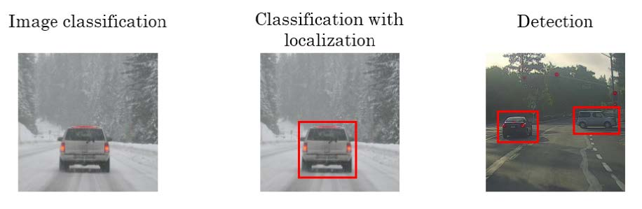

对于目标定位和目标检测问题，其模型如下所示： 
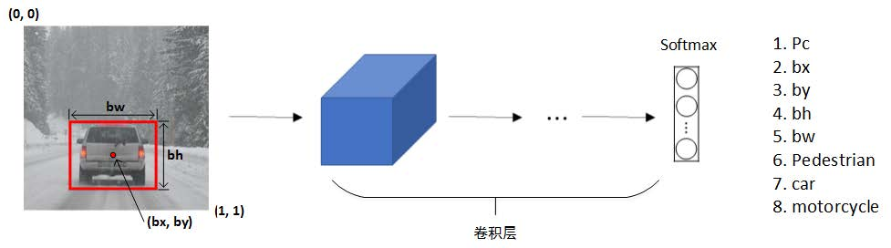
原始图片经过CONV卷积层后，Softmax层输出8 x 1向量。除了包含上述一般CNN分类3 x 1向量（class label）之外，还包含了(bx, by)，表示目标中心位置坐标；还包含了bh和bw，表示目标所在矩形区域的高和宽；还包含了Pc，表示矩形区域是目标的概率，数值在0～1之间，且越大概率越大。一般设定图片左上角为原点(0, 0)，右下角为(1, 1)。在模型训练时，bx、by、bh、bw都由人为确定其数值。例如上图中，可得bx=0.5，by=0.7，bh=0.3，bw=0.4。

训练集不仅包含神经网络要预测的对象分类标签，还要包含表示边界框的这四个数字，接着采用监督学习法，输出一个分类标签，还有四个参数值，从而给出检测对象的边框位置。

为监督学习任务定义目标标签y：

当Pc=1时， 

当Pc=0时，即没有检测到目标，则后七个参数毫无意义，用？表示： 
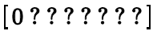

对于损失函数Loss function，若使用平方误差形式，有两种情况：
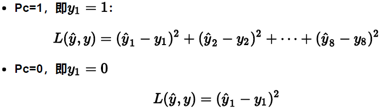

以上利用神经网络输出批量实数来识别图片中的对象，而另一种思路是把神经网络输出的实数集作为一个回归任务，具体看下一节。
### 3.2 特征点检测
除了使用矩形区域检测目标类别和位置外，我们还可以仅对目标的关键特征点坐标进行定位，这些关键点被称为landmarks。
例如人脸识别，可以对人脸部分特征点坐标进行定位检测，并标记出来，如下图所示：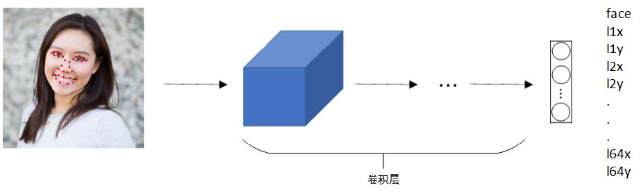

该网络模型共检测人脸上64处特征点，加上是否为face的标志位，输出label共有64x2+1=129个值。通过检测人脸特征点可以进行表情识别与判断，或者应用于AR领域等等。
除了人脸特征点检测之外，还可以检测人体姿势动作，如下图所示：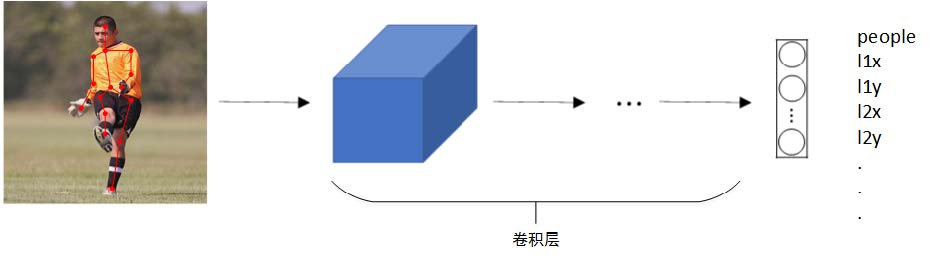

当然这些神经网络的训练集中的特征点需要人工手动的标出来，并且需要注意每一张图片中各个特征点的(x,y)坐标值所对应的特征必须保持一致。
### 3.3 目标检测
目标检测的一种简单方法是基于滑动窗口的目标检测算法。这种算法首先在训练样本集上搜集相应的各种目标图片和非目标图片，作为对于训练集的期望。注意应将训练集裁剪为尽量仅包含相应目标且居于中间位置，如下图所示：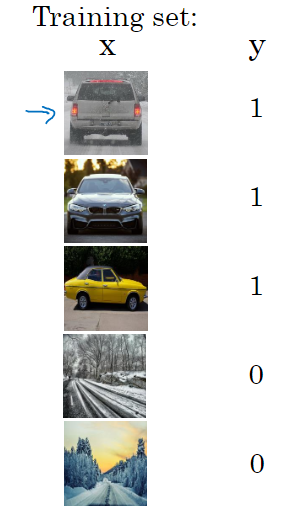

然后，使用这些训练集构建CNN模型，使得模型有较高的识别率。

最后，在测试图片上，选择大小适宜的窗口、合适的步进长度，进行从左到右、从上倒下的滑动来遍历整张图片。每个窗口区域都送入CNN模型进行识别判断。若判断有目标，则此窗口即为目标区域；若判断没有目标，则此窗口为非目标区域，这就是所谓的图像滑动窗口操作。
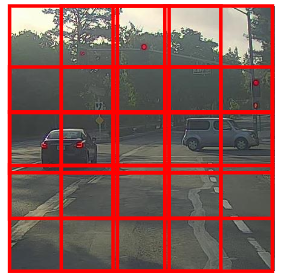

滑动窗口目标检测方法有明显的缺点是计算成本非常高，滑动窗口的大小、步幅需要人来设定。若窗口选择过大且步长过大，则会降低目标检测正确率；然而窗口尺寸小且步长较小，则整个目标检测的算法运行时间成本很高，每次滑动窗口区域都要进行一次CNN网络计算，计算成本较高；而计算成本问题目前已经有了很好的解决方案，大大提高了卷积层上应用滑动窗口目标检测器的效率。
### 3.4 滑动窗口的卷积实现
滑动窗口算法可以使用卷积方式实现，以提高运行速度，节约重复运算成本。把神经网络的全连接层转化为卷积层，如下图所示：
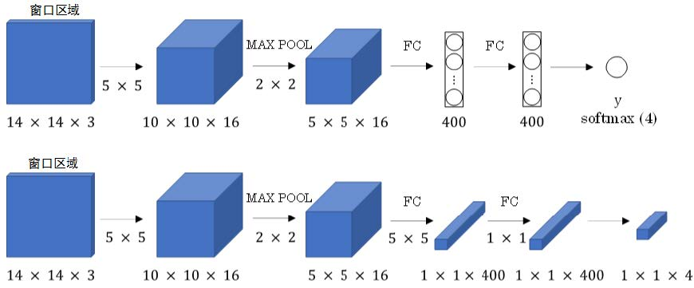

全连接层转变成卷积层的操作很简单，只需要使用与上层尺寸一致的滤波算子进行卷积运算即可。最终得到的输出层维度是1 x 1 x 4，代表4类输出值。

单个窗口区域卷积网络结构建立完毕之后，对于待检测图片，即可使用该网络参数和结构进行运算。例如16 x 16 x 3的图片，步进长度为2，CNN网络得到的输出层为2 x 2 x 4。其中，2 x 2表示共有4个窗口结果。对于更复杂的28 x 28 x3的图片，CNN网络得到的输出层为8 x 8 x 4，即共64个窗口结果。
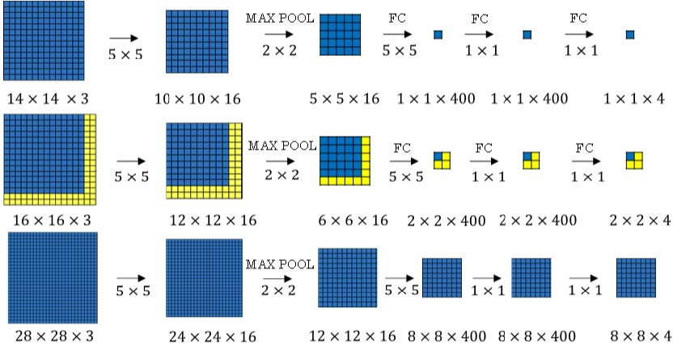

之前的滑动窗算法需要反复进行CNN正向计算，例如16 x 16 x 3的图片需进行4次，28 x 28 x3的图片需进行64次。而利用卷积操作代替滑动窗算法，则不管原始图片有多大，只需要进行一次CNN正向计算，即不需要把输入图像分成多个子集分别进行CNN正常运算，而是把它作为一张图片输入给卷积网络。因为其中共享了很多重复计算部分，这大大节约了运算成本。值得一提的是，窗口步进长度与选择的MAX POOL大小有关。如果需要步进长度为4，只需设置MAX POOL为4 x 4即可。
### 3.5 Bounding Box 预测
滑动窗口算法有时会出现滑动窗不能完全涵盖目标的问题（如下图蓝色窗口），YOLO（You Only Look Once）算法可以解决这类问题，生成更加准确的目标区域
（如下图红色窗口）。
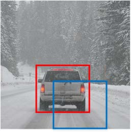

YOLO算法首先将原始图片分割成n x n网格，每个网格代表一块区域。为简化说明，下图中将图片分成3 x 3网格。
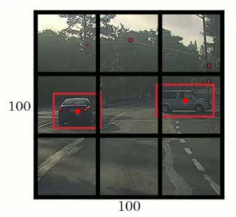

然后，利用上一节卷积形式实现滑动窗口算法的思想，对该原始图片构建CNN网络，得到的输出层维度为3 x 3 x 8。其中，3 x 3对应9个网格，每个网格的输出包含8个元素：
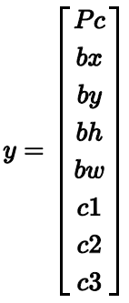

如果目标中心坐标(bx,by)不在当前网格内，则当前网格Pc=0；相反，则当前网格Pc=1（即只看中心坐标是否在当前网格内）。判断有目标的网格中，(bx,by)、bh、bw限定了目标区域。值得注意的是，每一个网格左上角坐标设定为(0, 0)，右下角坐标设定为(1,1)，(bx,by)范围限定在[0,1]之间，但是bh、bw可以大于1。因为目标可能超出该网格，横跨多个区域，如上图所示。目标占几个网格没有关系，目标中心坐标必然在一个网格之内。划分的网格可以更密一些。网格越小，则多个目标的中心坐标被划分到一个网格内的概率就越小。

YOLO算法显式的输出边界框坐标，可以具有任意宽高比，能输出更精准的坐标，不会受到滑动窗口分类器的步长大小限制。bx、by、bh、bw四个参数中，(bx,by)是相对于子网格的大小，bh、bw是子网格内图像的边框长度相对于子网格边框长度的比率。
### 3.6 交并比(Intersection over union)
IoU（并非means I own you money）即交集与并集之比，可以用来评价目标检测区域的准确性。
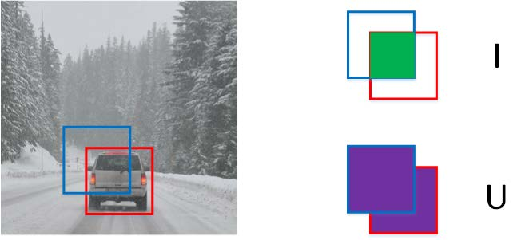
如上图所示，红色方框为真实目标区域，蓝色方框为检测目标区域。两块区域的交集为绿色部分，并集为紫色部分。蓝色方框与红色方框的接近程度可以用IoU比值来定义：
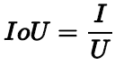
IoU可以表示任意两块区域的接近程度。IoU值介于0～1之间，且越接近1表示两块区域越接近，一般将IoU值设定为0.5来衡量目标检测算法的表现。
### 3.7 非极大抑制(Non-max suppression)
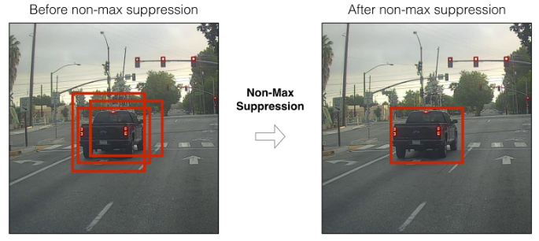
YOLO算法中，可能会出现多个网格都检测出到同一目标的情况，例如几个相邻网格都判断出同一目标的中心坐标在其内。下图中，三个绿色网格和三个红色网格分别检测的都是同一目标。那如何判断哪个网格最为准确呢？方法是使用非最大值抑制算法，可以确保算法对同一对象只检测一次，避免对同一对象做多次检测。

非最大值抑制（Nonmax Suppression）做法很简单，首先看每个网格所对应的Pc值，选取最大的那个认为是最可靠的检测；然后非极大抑制会将与这个最大Pc值对应的边框有高度重叠的其他边框抑制；逐一审视剩下的边框，找出Pc最高的一个，非极大抑制去掉其他LoU很高的边框，使得对目标对象只检测出一次。
pic non max supression
可以分两步理解非极大值抑制：首先去掉所有边界框Pc小于某个阈值(0.5)，即抛弃了概率比较低的输出边界框；然后像刚才描述的那样，逐个抛弃与这个最大Pc值对应的边框有高度重叠的其他边框。

值得一提的是，当对多个对象进行检测时，正确的做法是独立进行非极大抑制，对于每个输出类别都做一次。
### 3.8 Anchor Boxes
到目前为止，我们见到的都是一个网格至多只能检测一个目标。那对于多个目标重叠的情况，例如一个人站在一辆车前面，该如何使用YOLO算法进行检测呢？方法是使用不同形状的Anchor Boxes。如下图所示，同一网格出现了两个目标：人和车。为了同时检测两个目标，我们可以设置两个Anchor Boxes，Anchor box 1检测人，Anchor box 2检测车。也就是说，每个网格多加了一层输出。原来的输出维度是 3 x 3 x 8，现在是3 x 3 x 2 x 8（也可以写成3 x 3 x 16的形式）。这里的2表示有两个Anchor Boxes，用来在一个网格中同时检测多个目标。每个Anchor box都有一个Pc值，若两个Pc值均大于某阈值，则检测到了两个目标。 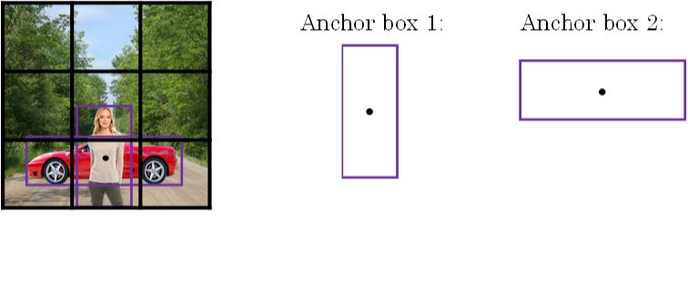

在使用YOLO算法时，只需对每个Anchor box使用上一节的非最大值抑制即可。Anchor Boxes之间并行实现。顺便提一下，Anchor Boxes形状的选择可以通过人为选取，也可以使用其他机器学习算法，例如k聚类算法对待检测的所有目标进行形状分类，选择主要形状作为Anchor Boxes。
### 3.9 YOLO算法
这一节主要介绍YOLO算法的流程，也是对前几节内容的回顾综合。网络结构如下图所示，包含了两个Anchor Boxes。
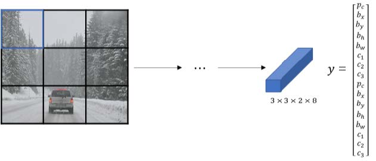

对于YOLO算法训练集的构造，包括输入图片及图片所对应的标签y，需要提前遍历每个网格来生成对应的标签y；算法在对输入做出预测时，生成对应数量的标签y_hat，然后通过non max suppression来得到最终的预测结果。
1. For each grid call, get 2 predicted bounding boxes.
2. Get rid of low probability predictions.
3. For each class (pedestrian, car, motorcycle) use non max suppression to generate final predictions.

YOLO的英文解释："You Only Look Once" (YOLO) is a popular algorithm because it achieves high accuracy while also being able to run in real-time. This algorithm "only looks once" at the image in the sense that it requires only one forward propagation pass through the network to make predictions. After non-max suppression, it then outputs recognized objects together with the bounding boxes.
### 3.10 候选区域(Region proposals)
之前学习的滑动窗口算法会对原始图片的每个区域都进行扫描，即使是一些空白的或明显没有目标的区域，例如下图所示。这样会降低算法运行效率，耗费时间。 
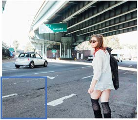

为了解决这一问题，尽量避免对无用区域的扫描，可以使用Region Proposals的方法。具体做法是先对原始图片进行图像分割算法处理，然后针对分割后的图片中的块进行目标检测。
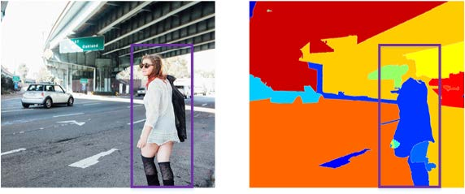
Region Proposals共有三种方法：
RCNN:滑动窗的形式，一次只对单个区域块进行目标检测，运算速度慢。
Fast RCNN:利用卷积实现滑动窗算法，类似第4节做法。
Faster RCNN:利用卷积对图片进行分割，进一步提高运行速度。
比较而言，Faster RCNN的运行速度还是比YOLO慢一些。

## 4 人脸识别与神经风格转换
### 4.1 什么是人脸识别？
首先简单介绍一下人脸验证（face verification）和人脸识别（face recognition）的区别。
人脸验证：输入一张人脸图片，验证输出与模板是否为同一人，即一对一问题。
人脸识别：输入一张人脸图片，验证输出是否为K个模板中的某一个，即一对多问题。
一般地，人脸识别比人脸验证更难一些。因为假设人脸验证系统的错误率是1%，那么在人脸识别中，输出分别与K个模板都进行比较，则相应的错误率就会增加，约K%。模板个数越多，错误率越大一些。
之后构造一个人脸验证作为基本模块，如果准确率够高，他就可以用在人脸识别系统上。
### 4.2 One-shot学习
Oneshot learning就是说数据库中每个人的训练样本只包含一张照片，然后训练一个CNN模型来进行人脸识别。若数据库有K个人，则CNN模型输出softmax层就是K维
的。但是Oneshot learning的性能并不好，其包含了两个缺点：
1. 每个人只有一张图片，训练样本少，构建的CNN网络不够健壮。
2. 若数据库增加另一个人，输出层softmax的维度就要发生变化，相当于要重新构建并训练CNN网络，使模型计算量大大增加，不够灵活。
为了解决Oneshot learning的问题，我们先来介绍相似函数（similarity function）。
相似函数表示两张图片的相似程度，用d(img1,img2)来表示。若d(img1,img2)较小，则表示两张图片相似；若d(img1,img2)较大，则表示两张图片不是同一个人。相似函数可以在人脸验证中使用：pic 1

对于人脸识别问题，则只需分别计算测试图片与数据库中K个目标的相似函数，取其中d(img1,img2)最小的目标为匹配对象。若所有的d(img1,img2)都很大，则表示数据库没有这个人。
### 4.3 Siamese Network
上节中提到的函数d的作用就是输入两张人脸，然后得到它们的相似度，实现这一功能的一个方式是用Siamese网络。
若一张图片经过一般的CNN网络（包括CONV层、POOL层、FC层），最终得到全连接层FC，该FC层可以看成是原始图片的编码encoding，表征了原始图片的关键特征。这个网络结构我们称之为Siamese network。也就是说每张图片经过Siamese network后，由FC层每个神经元来表征。pic 2
建立Siamese network后，两张图片x(1)和x(2)的相似度函数d可由各自FC层f(x(1))与f(x(2))之差的范数来表示：pic 3
值得一提的是，不同图片的CNN网络所有结构和参数都是一样的。我们的目标就是利用梯度下降算法，不断调整网络参数，使得属于同一人的图片之间d很小，而不同人的图片之间的d很大。pic 4
### 4.4 Triplet损失
构建人脸识别的CNN模型，需要定义合适的损失函数，这里我们将引入Triplet Loss。
Triplet Loss需要每个样本包含三张图片：靶目标（Anchor）、正例（Positive）、反例（Negative），这就是triplet名称的由来。顾名思义，靶目标和正例是同一人，靶目标和反例不是同一人。Anchor和Positive组成一类样本，Anchor和Negative组成另外一类样本。pic 5
由上一节构建的Siamese Network在数学上应满足：pic 6
根据上面的不等式，如果所有的图片都是零向量，即 pic 7那么上述不等式也满足。但是这对我们进行人脸识别没有任何作用，是不希望看到的。所以，我们添加一个超参数，对上述不等式做出如下修改：pic 8
顺便提一下，这里的α也被称为边界margin，类似与支持向量机中的margin。
接下来，我们根据A，P，N三张图片，就可以定义Loss function为：pic 9
相应地，对于m组训练样本，cost function为：pic 10

关于训练样本，必须保证同一人包含多张照片，否则无法使用这种方法。例如10k张照片包含1k个不同的人脸，则平均一个人包含10张照片。这个训练样本是满足要求
的。然后，就可以使用梯度下降算法，不断训练优化CNN网络参数，让J不断减小接近0。同一组训练样本，A，P，N的选择尽可能不要使用随机选取方法。因为随机选择的A与P一般比较接近，A与N相差也较大，毕竟是两个不同人脸。这样的话，也许模型不需要经过复杂训练就能实现这种明显识别，但是抓不住关键区别。所以，最好的做法是人为选择A与P相差较大（例如换发型，留胡须等），A与N相差较小（例如发型一致，肤色一致等）。这种人为地增加难度和混淆度会让模型本身去寻找学习不同人脸之间关键的差异，使得模型性能更好。

值得一提的是，现在许多商业公司构建的大型人脸识别模型都需要百万级别甚至上亿的训练样本。如此之大的训练样本我们一般很难获取。但是一些公司将他们训练的人脸识别模型发布在了网上，可供我们使用。
### 4.5 人脸验证与二分类
除了构造triplet loss来解决人脸识别问题之外，还可以使用二分类结构来训练Siamese Network。做法是将两个Siamese网络组合在一起，将各自的编码层输出经过一个逻辑输出单元，该神经元使用sigmoid函数，输出1则表示识别为同一人，输出0则表示识别为不同人。结构如下：pic11
每组训练样本包含两张图片，两个Siamese网络结构和参数完全相同。这样就把人脸识别问题转化成了一个二分类问题。引入逻辑输出层参数w和b，输出表达式为：pic12
其中参数w和b都是通过梯度下降算法迭代训练得到的。
y_hat的另外一种表达式为：pic13
在训练好网络之后，进行人脸识别的常规方法是测试图片与模板分别进行网络计算，编码层输出比较，计算逻辑输出单元。为了减少计算量，可以使用预计算的方式在训练时就将数据库每个模板的编码层输出f(x)保存下来。因为编码层输出比原始图片数据量少很多，所以无须保存模板图片，只要保存每个模板的即可，节约存储空间。而且，测试过程中，无须计算模板的siamese网络，只要计算测试图片的siamese网络，得到的结果直接与存储的模板进行下一步的逻辑输出单元计算即可，计算时间减小了接近一半。这种方法也可以应用在上一节的triplet loss网络中。
### 4.6 什么是神经风格迁移？
神经风格迁移是CNN模型一个非常有趣的应用。它可以实现将一张图片的风格“迁移”到另外一张图片中，生成具有其特色的图片。比如我们可以将毕加索的绘画风格迁
移到我们自己做的图中，生成类似的“大师作品”。下面列出几个神经风格迁移的例子：pic14
一般用C表示内容图片，S表示风格图片，G表示生成的图片。为了实现神经风格迁移，你需要知道卷积网络提取的深层的、浅层的特征，接下来介绍的是卷积神经网络不同层之间的具体运算。
### 4.7 深度卷积网络学习什么？
典型的CNN网络如下所示：pic15
首先来看第一层隐藏层，遍历所有训练样本，找出让该层激活函数输出最大的9块图像区域；然后再找出该层的其它单元（不同的滤波器通道）激活函数输出最大的9块图像区域；最后共找9次，得到9 x 9的图像如下所示，其中每个3 x 3区域表示一个运算单元。
pic 16
可以看出，第一层隐藏层一般检测的是原始图像的边缘和颜色阴影等简单信息。继续看CNN的更深隐藏层，随着层数的增加，捕捉的区域更大，特征更加复杂，从边
缘到纹理再到具物体信息。pic 17
### 4.8 代价函数
神经风格迁移生成图片G的cost function由两部分组成：C与G的相似程度和S与G的相似程度：pic18
其中α和β是超参数，用来调整两部分的相对权重。pic19 20
神经风格迁移的基本算法流程是：首先令G为随机像素点，随机初始化生成图像G，然后使用梯度下降算法，不断修正G的所有像素点，使得J(G)不断减小，从而使G逐渐有C的内容和G的风格，如下图所示。pic 21
### 4.9 content cost function
Content cost function表示内容图片C与生成图片G之间的相似度。使用的CNN网络是之前训练好的模型，例如AlexNet。C，S，G共用相同的模型和参数。

首先，需要选择合适的层数来计算G_content(C,G)。根据上一小节的内容，CNN的每个隐藏层分别提取原始图片的不同深度特征，由简单到复杂。如果层数选择过小，则G与C在像素上会非常接近，没有迁移效果；如果太深，则G上某个区域将直接会出现C中的物体。因此， 既不能太浅也不能太深，一般选择网络的中间层。

然后比较C和G在l层的激活函数输出a[l](C)与a[l](G)。相应的G_content(C,G)的表达式为：pic 22
使用梯度下降算法，不断迭代修正G的像素值，使G_content(C,G)不断减小。
### 4.10 Style Cost Function
什么是图片的风格？利用CNN网络模型，图片的风格可以定义为第l层隐藏层不同通道间激活函数的乘积（相关性）。pic 23
例如我们选取第l层隐藏层，其各通道使用不同颜色标注。因为每个通道提取图片的特征不同，比如1通道（红色）提取的是图片的垂直纹理特征，2通道（黄色）提取的是图片的橙色背景特征。那么计算这两个通道的相关性大小。相关性越大，表示原始图片既包含了垂直纹理也包含了该橙色背景；相关性越小，表示原始图片并没有同时包含这两个特征。也就是说，计算不同通道的相关性，反映原始图片特征间的相互关系，从某种程度上刻画了图片的“风格”。

接下来定义图片的风格矩阵（style matrix）为：pic24
其中，[l]表示第l层隐藏层，k，k'分别表示不同通道，总共通道数为nc[l]。i，j分别b表示该隐藏层的高度和宽度。风格矩阵G[l]_kk'计算第l层隐藏层不同通道对应的所有激活函数输出和。G[l]_kk'的维度为nc[l]xnc[l]。若两个通道之间相似性高，则对应的G[l]_kk'较大；若两个通道之间相似性低，则对应的G[l]_kk'较小。下图的Gram matrix中形象的展示了两个通道之间的相似性。pic 31 

风格矩阵G[l](S)_kk'表征了风格图片S第层隐藏层的“风格”。相应地，生成图片G也有G[l](G)_kk'。那么，G[l](G)_kk'与G[l](S)_kk'越相近，则表示G的风格越接近S。这样，我们就可以定义出J[l]_style(S,G)的表达式：PIC 25
定义完J[l]_style(S,G)之后，我们的目标就是使用梯度下降算法，不断迭代修正G的像素值，使J[l]_style(S,G)不断减小。
值得一提的是，以上我们只比较计算了一层隐藏层。为了提取的“风格”更多，也可以使用多层隐藏层，然后相加，表达式为：pic 26
其中，λ[l]表示累加过程中各层J[l]_style(S,G)的权重系数，为超参数。与content不同，content往往通过单层隐藏层即可获取，而style通过多层隐藏层得到会有更好的结果。
根据以上两小节的推导，最终的cost function为：pic 27
使用梯度下降算法进行迭代优化，进而得到最终的神经风格转换图片。
### 4.11 一维到三维的推广
我们之前介绍的CNN网络处理的都是2D图片，举例来介绍2D卷积的规则：pic28
输入图片维度：14 x 14 x 3
滤波器尺寸：5 x 5 x 3，滤波器个数：16
输出图片维度：10 x 10 x 16
将2D卷积推广到1D卷积，举例来介绍1D卷积的规则：pic29
输入时间序列维度：14 x 1
滤波器尺寸：5 x 1，滤波器个数：16
输出时间序列维度：10 x 16
对于3D卷积，举例来介绍其规则：pic30
输入3D图片维度：14 x 14 x 14 x 1
滤波器尺寸：5 x 5 x 5 x 1，滤波器个数：16
输出3D图片维度：10 x 10 x 10 x 16

Conclusion:
* 之前我们学过的很多算法，优化代价函数的目的是为了得到W、b等参数的值；而在神经风格转换(NST)中，我们优化代价函数的目的是为了得到生成图的像素值。
* 神经风格转换(NST)是一种算法，给定一个内容图像和风格图像，来将二者结合起来生成具有两者特点的一幅图像。他使用提前训练好的卷积神经网络（提前训练好的含义为该神经网络的W、b等参数已经确定），content cost function只通过一层隐藏层的激活函数计算，style cost function的计算通过多层隐藏层，通过优化total cost function来合成新的图片。
